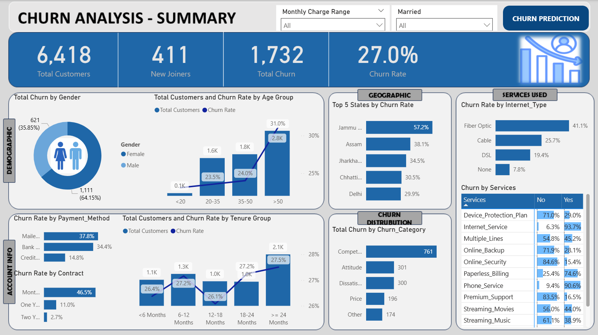
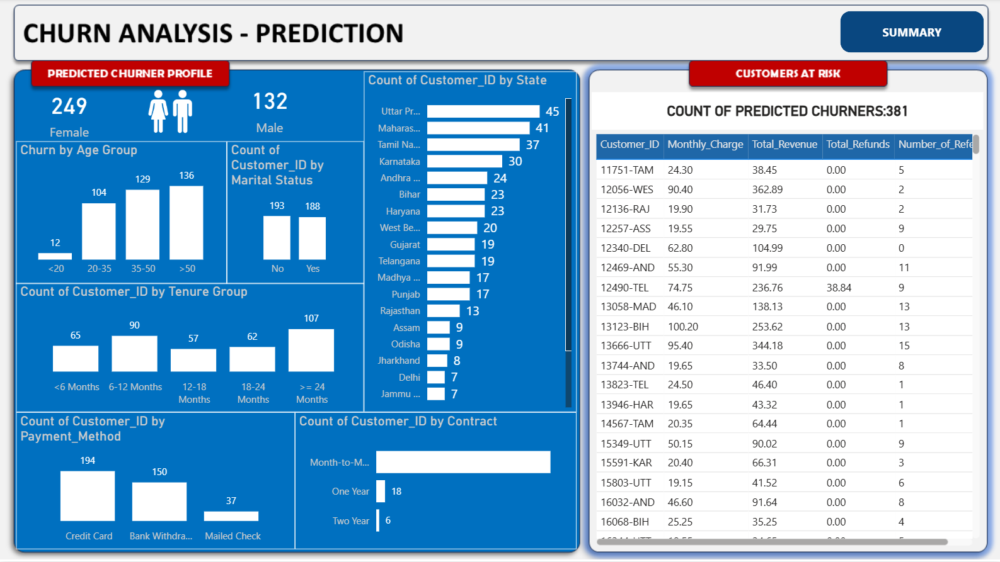

# 📊 Customer Churn Analysis & Prediction Dashboard

---

## 📑 Table of Contents

- [Project Title](#-project-title)
- [Brief One Line Summary](#-brief-one-line-summary)
- [Overview](#-overview)
- [Problem Statement](#-problem-statement)
- [Dataset](#-dataset)
- [Tools and Technologies](#-tools-and-technologies)
- [Methods](#-methods)
- [Key Insights](#-key-insights)
- [Dashboard / Model / Output](#-dashboard--model--output)
- [How to Run this Project](#-how-to-run-this-project)
- [Results & Conclusion](#-results--conclusion)
- [Future Work](#-future-work)
- [Author & Contact](#-author--contact)

---

## 🏷️ Project Title

Customer Churn Analysis & Prediction Dashboard

---

## ⚡ Brief One Line Summary

End-to-end churn analysis project using SQL, Power BI, and Machine Learning to identify churn drivers and predict high-risk customers.

---

## 📌 Overview

This project analyzes telecom customer data to uncover churn patterns and build a predictive model. It combines **data cleaning, exploratory analysis, dashboarding, and machine learning** to deliver actionable business insights.

---

## ❗ Problem Statement

The business faces:

- High customer churn rate
- Lack of clarity on churn drivers
- Ineffective retention strategies

Goal: Identify key churn factors and predict customers likely to churn.

---

## 📂 Dataset

The dataset includes:

- Customer demographics (Age, Gender, Marital Status)
- Account details (Tenure, Contract Type, Payment Method)
- Service usage (Internet type, add-ons)
- Financial metrics (Monthly Charges, Total Revenue)
- Churn status, category, and reasons

---

## 🛠️ Tools and Technologies

- **MySQL** → Data cleaning, transformation, views
- **Power BI** → Dashboard & visualization
- **Python (Jupyter Notebook)** → Random Forest model

---

## ⚙️ Methods

- Data Cleaning (null handling, transformations)
- Exploratory Data Analysis (EDA)
- SQL Views creation (churned, active, new customers)
- Dashboard development in Power BI
- Machine Learning model (Random Forest Classifier)

---

## 🔍 Key Insights

- 📄 Month-to-Month contracts → **46.5% churn (highest)**
- 💳 Mailed Check users → **37.8% churn**
- 🌐 Fiber Optic users → **41.1% churn**
- 👥 Female customers → **64% of churn**
- 🗺️ Highest churn: **Jammu & Kashmir (57.2%)**

➡️ Major drivers: **pricing, contract type, service quality**

---

## 📊 Dashboard / Model / Output

### 🔹 Summary Dashboard



### 🔹 Churn Prediction Dashboard



### 🤖 Model Performance

- Accuracy: **85%**
- Precision: 0.83
- Recall: 0.65

Predicted churners: **381 customers**

---

## ▶️ How to Run this Project?

1. Clone the repository
2. Open SQL scripts in MySQL and run data cleaning queries
3. Load dataset into Power BI
4. Open `.pbix` file in Dashboard folder
5. Run Jupyter Notebook for ML model

---

## 📂 Project Structure
```
├── Data/
│ └── Raw & cleaned datasets
│
├── Data Cleaning/
│ └── SQL scripts for data cleaning, null handling, transformations
│
├── EDA/
│ └── Exploratory Data Analysis (SQL / Python)
│
├── Views/
│ └── SQL views for churned, active, and new customers
│
├── Dashboard/
│ └── Power BI dashboard (.pbix)
│
├── Machine Learning Model/
│ └── Churn prediction model (Jupyter Notebook)
│
├── Images/
│ └── Dashboard screenshots for README
│
├── Report/
│ └── Final project report / documentation
│
└── README.md
```
---

## 📈 Results & Conclusion

- Churn rate identified at **27%**
- High-risk segments successfully identified
- Predictive model enables proactive retention

This project demonstrates a complete **data analytics + ML pipeline** for business decision-making.

---

## 🔮 Future Work

- Improve model recall using XGBoost / SMOTE
- Deploy model for real-time predictions
- Integrate customer feedback data

---

## 📬 Author & Contact

**Raj Nandini**  
📧 rajnandini7802@gmail.com  
🔗 www.linkedin.com/in/rajnandini02
